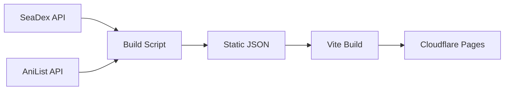

# SeaDex Mirror

[](LICENSE)
[](https://github.com/EithonX/seadex-mirror/actions/workflows/rebuild-mirror.yml)
[](https://github.com/EithonX/seadex-mirror/actions/workflows/deploy-site.yml)

An unofficial static mirror of [SeaDex](https://releases.moe) ([source](https://github.com/seadex-moe/seadex)), the anime release recommendation index. Built as a static site so the data stays accessible even when the original is down.

**Live site:** [seadex.pages.dev](https://seadex.pages.dev)

## How it works



The build script pulls all public entry and torrent data from the SeaDex PocketBase API, enriches it with AniList metadata (titles, covers, scores, relations), and writes everything as static JSON files. Vite bundles the frontend, and the result gets deployed to Cloudflare Pages as a fully static site.

No database, no server-side runtime, no API keys required for browsing.

## Getting started

**Prerequisites:** Node.js 24+

```bash
git clone https://github.com/EithonX/seadex-mirror.git
cd seadex-mirror
npm install
npm run dev
```

To build with live data from upstream:

```bash
npm run data:build
npm run dev
```

## Commands

| Command | What it does |
|---|---|
| `npm run dev` | Start the Vite dev server |
| `npm run build` | Build a deployable site snapshot |
| `npm run build:frontend` | Build only the frontend |
| `npm run data:build` | Fetch live data from SeaDex + AniList |
| `npm run build:site` | Build data and frontend together |
| `npm run deploy` | Deploy to Cloudflare Pages |
| `npm run typecheck` | Run TypeScript type checking |
| `npm run verify:mirror-data` | Verify generated JSON structure |
| `npm run verify:frontend-build` | Verify production build output |

## Data pipeline

The build script ([`scripts/build-static-data.mjs`](scripts/build-static-data.mjs)):

1. Fetches entry IDs from the `listIDs` endpoint
2. Fetches all entries with expanded torrent data (`expand=trs`)
3. Verifies parity between the two data sources
4. Resolves relative torrent URLs against `https://releases.moe`
5. Fetches AniList metadata for each entry
6. Enriches franchise relation data for entry detail pages
7. Writes static JSON files into `frontend/public/mirror-data/`

### Output files

| File | Used by |
|---|---|
| `catalog.json` | Home page — table filtering and search |
| `entries/<alId>.json` | Individual entry pages |
| `sheet-workbook.json` | Sheet view (lazy-loaded separately) |
| `status.json` | Mirror freshness indicator |

### Unchanged-upstream behavior

The data builder supports two modes when upstream data hasn't changed:

- **`--onUnchanged=skip`** — For scheduled CI rebuilds. Exits early without rebuilding or deploying.
- **`--onUnchanged=materialize`** — For deploy builds. Reconstructs local data from cache when upstream is unchanged but local files are missing (e.g. fresh CI checkout).

## Deployment

Deployed to Cloudflare Pages through GitHub Actions using Wrangler Direct Upload.

### Required secrets

| Secret | Purpose |
|---|---|
| `CLOUDFLARE_ACCOUNT_ID` | Cloudflare account identifier |
| `CLOUDFLARE_API_TOKEN` | API token with Pages deploy permissions |

### Optional

| Secret / Variable | Purpose |
|---|---|
| `CLOUDFLARE_PAGES_PROJECT_NAME` | Pages project name (default: `seadex`) |
| `ANILIST_ACCESS_TOKEN` | Authenticated AniList access for higher rate limits |

### Workflows

[`rebuild-mirror.yml`](.github/workflows/rebuild-mirror.yml) runs every 12 hours. Only rebuilds and deploys when upstream data actually changed. Supports a manual `force` trigger.

[`deploy-site.yml`](.github/workflows/deploy-site.yml) runs on pushes to `main` that touch frontend code, scripts, or build config. Uses `--onUnchanged=materialize` so frontend-only changes still deploy with complete data.

### Cache policy

| Path | TTL |
|---|---|
| `catalog.json`, `status.json`, `sheet-workbook.json` | 60 seconds |
| `entries/*` | 15 minutes |
| Hashed frontend assets | Immutable |

## Contributing

See [CONTRIBUTING.md](CONTRIBUTING.md) for setup instructions and guidelines.

## License

[GNU General Public License v3.0](LICENSE)

## Credits

- [SeaDex](https://releases.moe) ([source](https://github.com/seadex-moe/seadex)) — the upstream project this mirrors
- [AniList](https://anilist.co) — anime metadata
