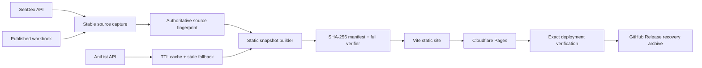

# SeaDex Mirror

[](LICENSE)
[](https://github.com/EithonX/seadex-mirror/actions/workflows/rebuild-mirror.yml)
[](https://github.com/EithonX/seadex-mirror/actions/workflows/deploy-site.yml)

An unofficial, fully static mirror and recovery backup of [SeaDex](https://releases.moe) ([source](https://github.com/seadex-moe/seadex)). The project is intentionally designed to run without a database, server process, paid storage service, or server-side application runtime.

**Live site:** [seadex.pages.dev](https://seadex.pages.dev)

## Architecture


```mermaid
flowchart LR
    A[SeaDex API] --> B[Stable source capture]
    C[Published workbook] --> B
    B --> D[Authoritative source fingerprint]
    E[AniList API] --> F[TTL cache + stale fallback]
    D --> G[Static snapshot builder]
    F --> G
    G --> H[SHA-256 manifest + full verifier]
    H --> I[Vite static site]
    I --> J[Cloudflare Pages]
    J --> K[Exact deployment verification]
    K --> L[GitHub Release recovery archive]
```

The live site is only static HTML, CSS, JavaScript, and JSON. Browsing it requires no API keys and executes no server-side application code.

The backup pipeline is deliberately fail-closed: a partial SeaDex response, inconsistent expanded torrent set, corrupted generated file, incomplete remote sync, or mismatched deployment is rejected rather than replacing the previous known-good snapshot.

## What makes a snapshot trustworthy

Every scheduled build performs the following checks before it can become the live backup:

1. Fetch the full SeaDex ID list and full expanded entry/torrent dataset.
2. Verify ID parity and linked-vs-expanded torrent parity.
3. Fetch SeaDex repeatedly until two consecutive complete source captures have the same SHA-256 fingerprint. This avoids publishing a mixed snapshot while upstream is changing.
4. Fetch the published workbook and include its raw SHA-256 in the authoritative source fingerprint.
5. Reuse fresh AniList cache records, refresh records older than the configured TTL, and keep stale cached metadata if AniList is temporarily unavailable.
6. Build the complete static snapshot in a staging directory.
7. Generate `manifest.json`, containing every snapshot file's byte size and SHA-256 digest.
8. Verify every file against the manifest and verify catalog/entry/torrent invariants.
9. Atomically replace the previous local snapshot only after verification succeeds.
10. Build the frontend and check Cloudflare Pages file-count/per-file-size limits before deployment.
11. Deploy to Cloudflare Pages, verify the unique deployment URL against the exact local snapshot ID and manifest hash, then verify the production alias.
12. Only after deployment verification succeeds, archive the verified `mirror-data` snapshot as a rolling GitHub Release recovery asset.

A scheduled run can therefore fail without destroying the last usable backup.

## Recovery copies

Cloudflare Pages is the live serving copy. GitHub Releases is the independent recovery copy.

Successful deploys create release tags in this form:

```text
snapshot-<snapshot-id>-<manifest-sha-prefix>
```

Each automated recovery release contains:

- `seadex-mirror-<snapshot-id>.tar.gz` — the complete `mirror-data/` directory
- `archive.sha256` — checksum for the compressed archive
- `manifest.json` — per-file manifest for the uncompressed snapshot
- `manifest.sha256` — checksum for the manifest itself

The workflow retains the newest 14 automated snapshot releases and prunes older `snapshot-*` releases. Normal project releases are never touched.

### Recover from the live mirror

If upstream is unavailable but the Cloudflare copy is healthy:

```bash
npm run data:sync-live
npm run verify:mirror-data
```

`data:sync-live` fetches the remote manifest first, downloads exactly the files it names, verifies every byte count and SHA-256 digest in staging, and then performs an atomic replacement. A failed sync leaves the existing local snapshot intact.

### Recover from a GitHub Release

If both upstream and the live Cloudflare deployment are unavailable:

1. Download a known-good automated snapshot release.
2. Verify the downloaded files before extracting them:

```bash
sha256sum -c archive.sha256
sha256sum -c manifest.sha256
```

3. Extract the archive directly beneath `frontend/public/`:

```bash
mkdir -p frontend/public
tar -C frontend/public -xzf seadex-mirror-<snapshot-id>.tar.gz
```

4. Run:

```bash
npm run verify:mirror-data
npm run build:frontend
npm run verify:frontend-build
npm run verify:pages-limits
```

Then deploy the verified static build normally.

## Getting started

**Prerequisite:** Node.js 24.x

```bash
git clone https://github.com/EithonX/seadex-mirror.git
cd seadex-mirror
npm ci
```

Generate a live snapshot and start the development server:

```bash
npm run data:build
npm run dev
```

The builder works with AniList's public GraphQL endpoint. `ANILIST_ACCESS_TOKEN` is optional and is used only by the build step when configured.

## Commands

| Command | Purpose |
|---|---|
| `npm run dev` | Start the Vite development server |
| `npm run build` | Build a complete deployable data + frontend snapshot |
| `npm run build:frontend` | Build only the frontend around existing mirror data |
| `npm run data:build` | Capture authoritative upstream data and build a verified local snapshot |
| `npm run data:sync-live` | Restore the currently deployed snapshot with manifest verification |
| `npm run typecheck` | Run strict TypeScript checks |
| `npm test` | Run regression tests for HTTP, atomic replacement, and snapshot integrity |
| `npm run verify` | Run typechecking and regression tests |
| `npm run verify:mirror-data` | Verify the full local manifest and every generated entry/invariant |
| `npm run verify:frontend-build` | Verify the production bundle and copied snapshot integrity |
| `npm run verify:pages-limits` | Fail before deploy if the built site exceeds configured Pages limits |
| `npm run verify:deployed-site` | Verify a deployed site against an expected snapshot/manifest identity |
| `npm run deploy` | Build and deploy directly with Wrangler |

## Data pipeline details

### Authoritative change detection

The scheduled workflow does **not** use a small recent-entry probe. It hashes the complete, validated SeaDex source representation plus the raw workbook SHA-256. Torrent-only changes and workbook-only changes therefore invalidate the source fingerprint even when entry IDs are unchanged.

`--onUnchanged=skip` is used by scheduled rebuilds. If the authoritative source fingerprint matches the deployed snapshot and no AniList cache record is due for refresh, CI exits without another deployment.

`--onUnchanged=materialize` is used for code-driven deployments from clean CI checkouts. When authoritative inputs are unchanged, the builder can reconstruct the same data snapshot using the deployed AniList cache so a frontend-only change still gets a complete static deployment.

### AniList resilience

AniList enriches SeaDex records but is not authoritative for the backed-up torrent data.

- Cache freshness defaults to 168 hours.
- Fresh cache records are reused without an API request.
- Missing or expired records are refreshed in paced batches.
- Authenticated requests fall back to public requests if configured authentication fails.
- A failed refresh retains stale cached AniList metadata when available.
- A newly missing AniList record does not cause valid SeaDex data to be discarded.

Override the TTL with `ANILIST_CACHE_TTL_HOURS` or `--anilistCacheTtlHours`.

### Generated snapshot

`frontend/public/mirror-data/` contains:

| File | Purpose |
|---|---|
| `manifest.json` | Snapshot identity, total bytes/files, and SHA-256 for every other snapshot file |
| `status.json` | Counts, source fingerprint, snapshot ID, timestamps, and integrity state |
| `catalog.json` | Compact catalog used for home-page filtering/search |
| `entries/<alId>.json` | Complete per-entry data and torrent rows |
| `sheet.json` | Compact sheet-oriented entry projection |
| `sheet-workbook.json` | Mirrored published workbook, loaded only on the Sheet page |
| `anilist-cache.json` | AniList enrichment cache with per-record fetch timestamps |

Generated mirror data is intentionally gitignored. Git stores the code; Cloudflare Pages serves the current copy; automated GitHub Releases retain independent known-good data copies.

## Frontend behavior

The frontend is designed to remain useful under partial failure:

- `status.json` is freshness metadata, not a hard dependency; catalog, entry, sheet, and about pages continue when it is temporarily unavailable.
- failed in-memory fetches are evicted so a retry can actually recover instead of reusing a rejected Promise.
- fatal states expose both **Try again** and **Return home** actions.
- external source/workbook/comparison URLs are protocol-validated before rendering; torrent actions additionally permit legitimate `magnet:` links.
- generated JSON is configured to revalidate instead of allowing long-lived browser copies from different deployments to linger together.
- the footer surfaces the active snapshot identity when freshness metadata is available.

## Deployment

The GitHub workflows use Cloudflare Pages Direct Upload.

### Required GitHub secrets

| Secret | Purpose |
|---|---|
| `CLOUDFLARE_ACCOUNT_ID` | Cloudflare account identifier |
| `CLOUDFLARE_API_TOKEN` | Token scoped for the Pages deployment |

### Optional secret / variable

| Name | Purpose |
|---|---|
| `CLOUDFLARE_PAGES_PROJECT_NAME` | Pages project name; defaults to `seadex` |
| `ANILIST_ACCESS_TOKEN` | Optional AniList bearer token |
| `ANILIST_CLIENT_ID` | Accepted for compatibility/documentation; does not authenticate public GraphQL by itself |
| `ANILIST_CLIENT_SECRET` | Accepted for compatibility/documentation; does not authenticate public GraphQL by itself |

Secrets are provided only to the steps that need them. Dependency installation, tests, and unrelated Actions do not receive Cloudflare or AniList credentials. Third-party Actions are pinned to immutable full commit SHAs and are kept current through Dependabot.

### Workflows

- [`rebuild-mirror.yml`](.github/workflows/rebuild-mirror.yml) runs every 12 hours and supports a manual forced rebuild.
- [`deploy-site.yml`](.github/workflows/deploy-site.yml) runs when deploy-relevant code/config changes on `main`, materializes verified mirror data, and deploys the updated static site.
- [`codeql.yml`](.github/workflows/codeql.yml) performs scheduled and PR/push CodeQL analysis.

The deploy jobs verify both the unique Cloudflare deployment URL and the production `pages.dev` alias before the snapshot becomes an archival release.

## Configuration

See [`.env.example`](.env.example). Important builder knobs include:

- `SOURCE_BASE_URL`
- `SHEET_WORKBOOK_URL`
- `ANILIST_GRAPHQL_URL`
- `ANILIST_ACCESS_TOKEN`
- `ANILIST_CACHE_TTL_HOURS`
- `MIRROR_STATUS_URL`

Network requests use bounded timeouts, retry transient HTTP failures (`408`, `425`, `429`, selected `5xx`), honor `Retry-After`, and enforce response-size ceilings where large upstream payloads are expected.

## Security

See [SECURITY.md](SECURITY.md). Do not disclose a suspected credential leak or exploitable vulnerability in a public issue.

## Contributing

See [CONTRIBUTING.md](CONTRIBUTING.md).

## License

[GNU General Public License v3.0](LICENSE)

## Credits

- [SeaDex](https://releases.moe) ([source](https://github.com/seadex-moe/seadex)) — upstream data/project
- [AniList](https://anilist.co) — anime metadata enrichment
