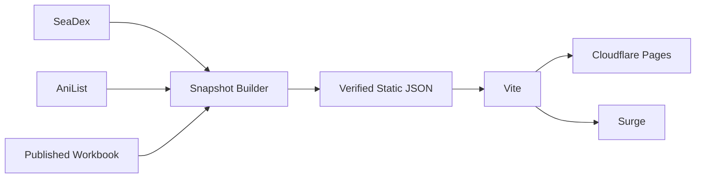

# SeaDex Mirror

[](LICENSE)
[](https://github.com/EithonX/seadex-mirror/actions/workflows/rebuild-mirror.yml)
[](https://github.com/EithonX/seadex-mirror/actions/workflows/deploy-site.yml)

An unofficial static mirror of [SeaDex](https://releases.moe) ([source](https://github.com/seadex-moe/seadex)), the anime release recommendation index. Built so the data stays accessible even when the original is unavailable.

**Primary:** [seadex.pages.dev](https://seadex.pages.dev) · **Backup:** [seadex.surge.sh](https://seadex.surge.sh)

## How it works


```mermaid
flowchart LR
    A[SeaDex] --> B[Snapshot Builder]
    C[AniList] --> B
    D[Published Workbook] --> B
    B --> E[Verified Static JSON]
    E --> F[Vite]
    F --> G[Cloudflare Pages]
    F --> H[Surge]
```

The builder pulls SeaDex entries and torrent data, mirrors the published workbook, enriches entries with AniList metadata, verifies the resulting snapshot, and writes static JSON for the frontend.

There is no database or server-side application runtime. Browsing the mirror requires no API keys.

Builds fail closed: incomplete or inconsistent upstream data does not replace the previous known-good snapshot.

## Getting started

**Prerequisite:** Node.js 24 or 26. CI uses Node.js 24.

```bash
git clone https://github.com/EithonX/seadex-mirror.git
cd seadex-mirror
npm ci
```

Build a fresh snapshot and start the development server:

```bash
npm run data:build
npm run dev
```

AniList authentication is optional. Without a token, the builder uses the public GraphQL API.

## Commands

| Command | What it does |
|---|---|
| `npm run dev` | Start the Vite development server |
| `npm run dev:pages` | Serve the production build with Wrangler Pages locally |
| `npm run build` | Build a complete deployable snapshot |
| `npm run build:frontend` | Build only the frontend |
| `npm run data:build` | Fetch upstream data and build a verified snapshot |
| `npm run data:sync-live` | Restore the current live snapshot locally |
| `npm run verify` | Run typechecking and regression tests |
| `npm run verify:mirror-data` | Verify generated mirror data and its manifest |
| `npm run verify:frontend-build` | Verify the production frontend output |
| `npm run verify:pages-limits` | Check the build against Cloudflare Pages limits |
| `npm run verify:surge-limits` | Check the build against Surge limits and SPA files |
| `npm run deploy` | Build and deploy with Wrangler |
| `npm run deploy:bootstrap` | Bootstrap Cloudflare from the existing verified local snapshot |
| `npm run deploy:surge-bootstrap` | Bootstrap Surge from the same verified local snapshot |

## Data pipeline

The builder:

1. Reads SeaDex's ID list and lightweight entry/torrent revision guards.
2. Fetches the complete entry collection with expanded torrents and accepts it only if the guards remain unchanged.
3. Mirrors the published workbook.
4. Enriches entries with AniList metadata, using a TTL cache and stale fallback.
5. Builds the snapshot in staging and verifies entry/torrent invariants.
6. Generates a SHA-256 manifest covering every mirrored data file.
7. Replaces the previous local snapshot only after verification succeeds.

Generated data lives under `frontend/public/mirror-data/` and is intentionally gitignored.

## Recovery

The verified site is published independently to Cloudflare Pages and Surge. Both hosts serve the same `snapshotId`, mirror manifest, and `site-build.json` fingerprint.

If upstream is unavailable but Cloudflare is healthy:

```bash
npm run data:sync-live
npm run verify:mirror-data
```

Scheduled checks also compare Surge with the primary deployment and repair the secondary mirror when it falls behind.

## Deployment

Deployment uses one verified `dist/` tree for both Cloudflare Pages and Surge. Provider publication is skipped independently when that host already serves the same site fingerprint.

### Required GitHub secrets

| Secret | Purpose |
|---|---|
| `CLOUDFLARE_ACCOUNT_ID` | Cloudflare account identifier |
| `CLOUDFLARE_API_TOKEN` | Token with Pages deployment access |
| `SURGE_TOKEN` | Surge automation token; preferably scoped to the mirror domain |

### Optional

| Name | Purpose |
|---|---|
| `CLOUDFLARE_PAGES_PROJECT_NAME` | Pages project name; defaults to `seadex` |
| `ANILIST_ACCESS_TOKEN` | Optional AniList bearer token |
| `SURGE_DOMAIN` | Surge hostname; defaults to `seadex.surge.sh` |

[`rebuild-mirror.yml`](.github/workflows/rebuild-mirror.yml) checks upstream every 12 hours, publishes changed snapshots to both hosts, and verifies/repairs the Surge mirror when the source is unchanged.

[`deploy-site.yml`](.github/workflows/deploy-site.yml) handles code-driven deployments from `main`. It restores the currently verified production snapshot before rebuilding the frontend, so code-only deploys do not need to refetch SeaDex or AniList.

For a new or intentionally reset Pages deployment, generate and verify a snapshot locally, authenticate Wrangler with `npx wrangler login`, then run `npm run deploy:bootstrap`.

To claim or reset the Surge mirror, authenticate once with the pinned Surge CLI and deploy the same local snapshot:

```bash
npm exec --yes --package=surge@0.41.2 -- surge login
npm exec --yes --package=surge@0.41.2 -- surge verify
npm run deploy:surge-bootstrap
```

After the domain exists, create a domain-scoped automation token with `npm exec --yes --package=surge@0.41.2 -- surge tokens add --domain seadex.surge.sh -m "GitHub Actions"` and store the returned token as the `SURGE_TOKEN` GitHub secret. CI does not include compatibility code for older snapshot schemas.

GitHub Actions are pinned to immutable commit SHAs. Cloudflare, Surge, and AniList credentials are exposed only to the steps that require them.

## Caching

Hashed frontend assets are cached immutably. Mirror JSON uses revalidation, allowing browsers to reuse unchanged responses while avoiding long-lived mixtures of data from different deployments.

## Security

See [SECURITY.md](SECURITY.md) for vulnerability reporting.

## Contributing

See [CONTRIBUTING.md](CONTRIBUTING.md).

## License

[GNU General Public License v3.0](LICENSE)

## Credits

- [SeaDex](https://releases.moe) ([source](https://github.com/seadex-moe/seadex)) — upstream project and data
- [AniList](https://anilist.co) — anime metadata
